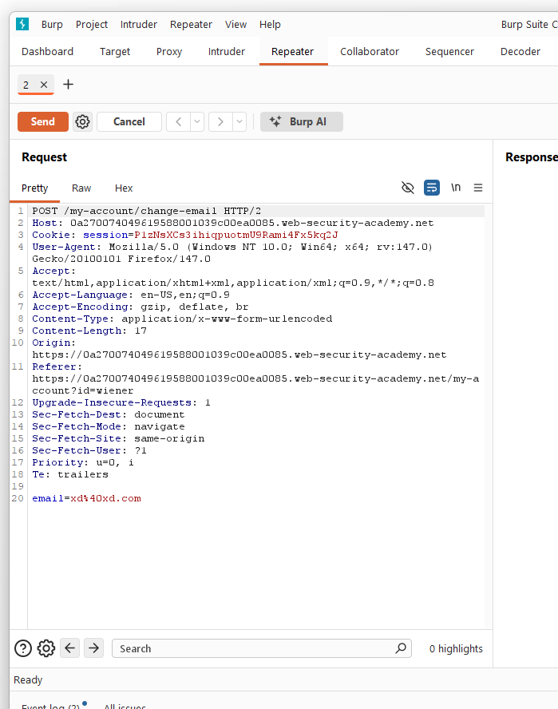
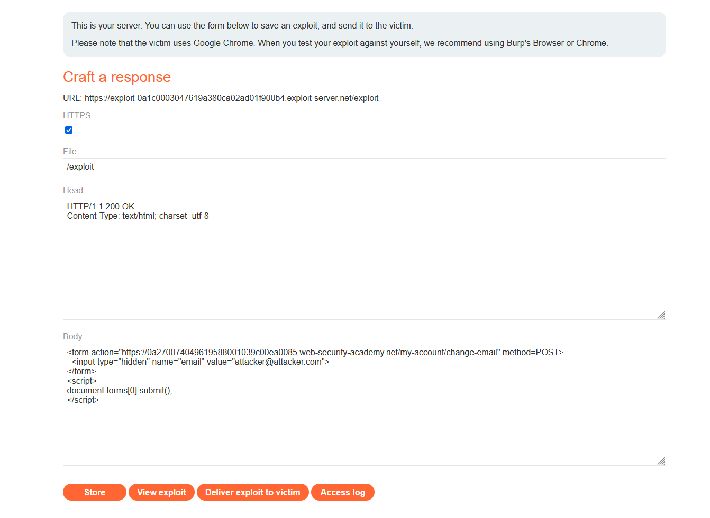
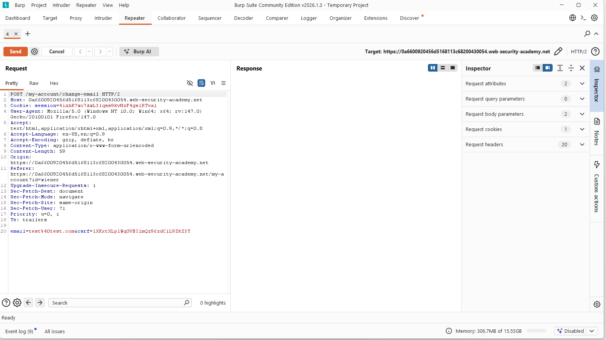
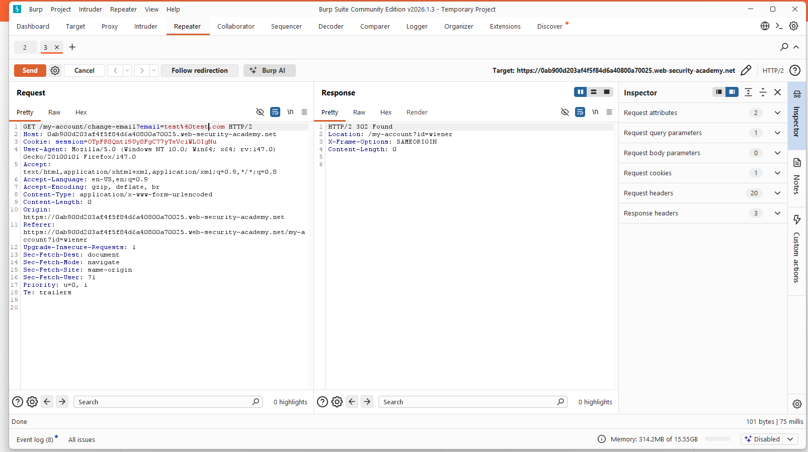
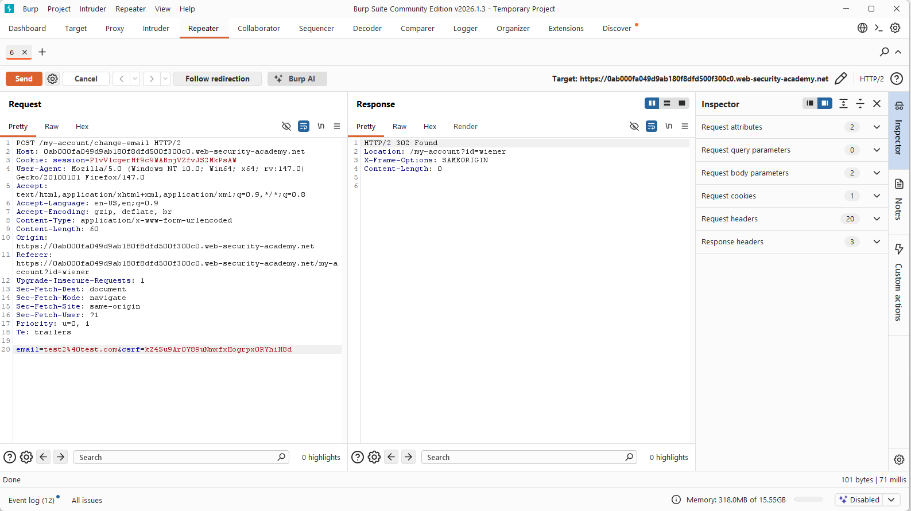

## Lab 1 - CSRF – No defenses

### Lab Objective

 - The application allows users to change their email address.
 - The functionality does not implement any CSRF protection.

Our goal is to force the victim’s browser to submit a request that changes their email address.

### Step 1 — Analyze the request

While changing the email address, we intercept the request in Burp:



## Observations

 - The request uses POST

 - No CSRF token is present

 - The application relies only on the session cookie

 - Therefore, the server trusts any request sent from the victim’s browser

 - This means the endpoint is vulnerable to CSRF.

### Step 2 — Understanding the attack

The browser automatically attaches cookies to requests for the target domain.

So if we make the victim’s browser send the same POST request:

 - The server will think the victim intentionally changed their email.

We don’t attack the server directly.
We trick the victim’s browser into performing a legitimate action.

### Step 3 — Crafting the exploit

We create a malicious HTML page that silently submits a form:




```html
<form action="https://LAB-ID.web-security-academy.net/my-account/change-email" method="POST">
  <input type="hidden" name="email" value="attacker@mail.com">
</form>

<script>
document.forms[0].submit();
</script>
```

### What happens

 - Victim opens the page

 - The form auto-submits

 - Browser includes session cookie

 - Server processes it as a real request

### Key takeaway

 - CSRF is not about stealing authentication.

 - It is about abusing existing authentication.

 - The browser becomes the attacker.


## CSRF — Token validation depends on request method

### Lab Objective

 - The application attempts to protect the email change functionality using a CSRF token.

 - However, the protection is only enforced for specific HTTP methods.

### Goal: 

Change the victim’s email address using CSRF.

### Step 1 — Analyze the request

While updating the email address we capture the request:



 - Request uses POST

 - A CSRF token is required

 - If the token is modified → request is rejected

 - So at first glance the endpoint seems protected.

### Step 2 — Testing method handling

The next step is to test whether the validation depends on the HTTP method.

We convert the request to GET and remove the CSRF token:



The server accepts the request and redirects back to the profile page.

### This indicates:

CSRF validation is only applied to POST requests.

The application performs the state-changing action even when no token is provided, as long as the method is GET.

### Step 3 — Exploitation

Since browsers automatically send authenticated GET requests while loading resources, we can trigger the action using a simple HTML tag:

```html

```

### Attack flow

 - Victim visits attacker page

 - Browser loads the image

 - Authenticated GET request is sent

 - Email address changes

 - No interaction required.

### Why the attack works

The defense logic is flawed:

 - CSRF token is validated only for POST

 - Sensitive action is allowed via GET

 - Browser automatically attaches session cookies

 - So the request becomes authenticated even though it originated from another site.


### CSRF — Token validation depends on token being present

### Lab Objective

The application implements a CSRF token mechanism for the email change functionality.

However, the validation logic is flawed and only verifies the token if it is included in the request.

### Goal: 

Perform a CSRF attack to change the victim’s email address.

### Step 1 — Analyze the request

After changing the email, we capture the request:




### Behavior testing
          Action	          Result

         Modify token	 Request rejected

         Remove token	 Request accepted

This indicates:

 - The server validates the CSRF token only when it exists.

 - If the token is missing, the request is still processed.

### Vulnerability

The application follows this logic:

```
if csrf exists:
    validate(csrf)
else:
    allow request
```

Instead of:

```
require csrf
validate csrf
```

So protection can be bypassed simply by omitting the token.


### Step 2 — Exploitation

We create a CSRF page that sends a POST request without a token:

```html
<form action="https://LAB-ID.web-security-academy.net/my-account/change-email" method="POST">
  <input type="hidden" name="email" value="attacker@attacker.com">
</form>

<script>
document.forms[0].submit();
</script>
```

### Attack flow

 - Victim visits attacker page

 - Form auto-submits

 - Browser includes session cookie

 - Server accepts request because no token is present

 - Email address changes

### Why this works

 - The defense only validates tokens conditionally.

 - Security checks must be mandatory, not optional.

 - The server trusts any authenticated request that does not contain a CSRF token.

### Key takeaway

CSRF protection fails if validation depends on token presence.

A secure implementation must:

 - Require a CSRF token

 - Validate it for every state-changing request

Otherwise the protection can be bypassed by simply removing the parameter.
