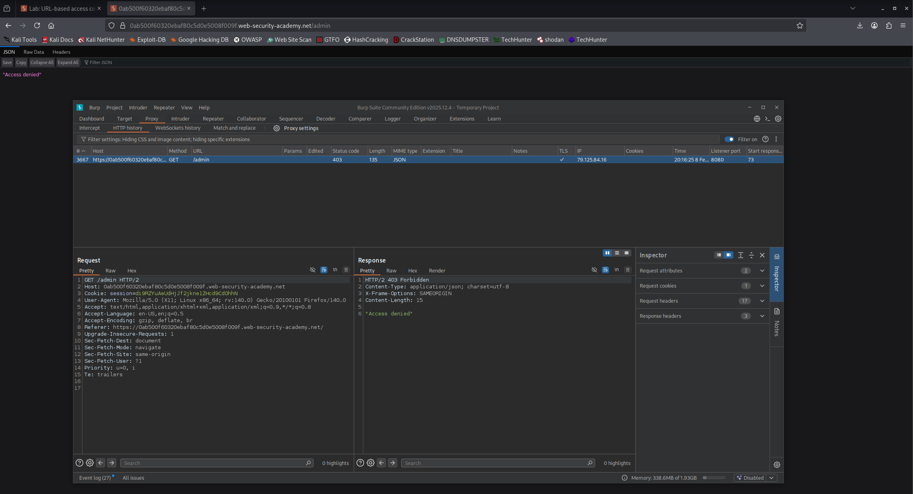
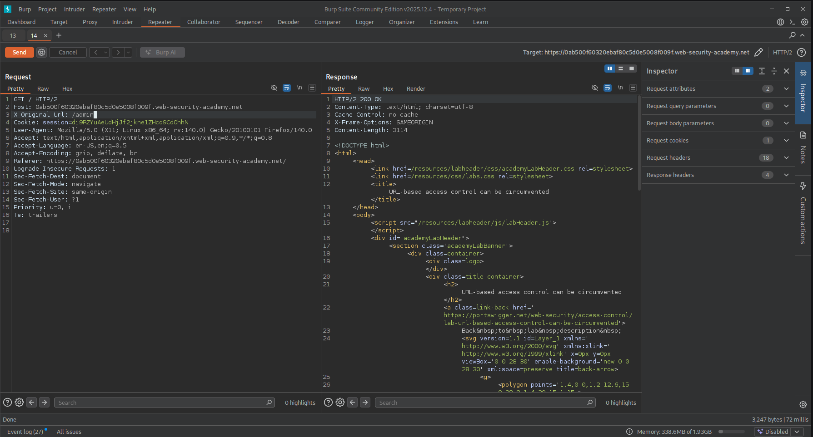
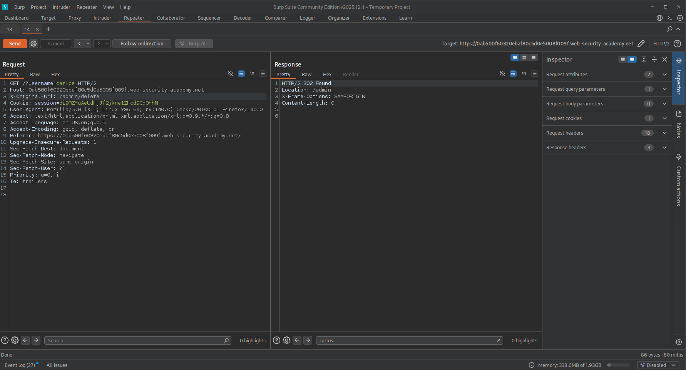
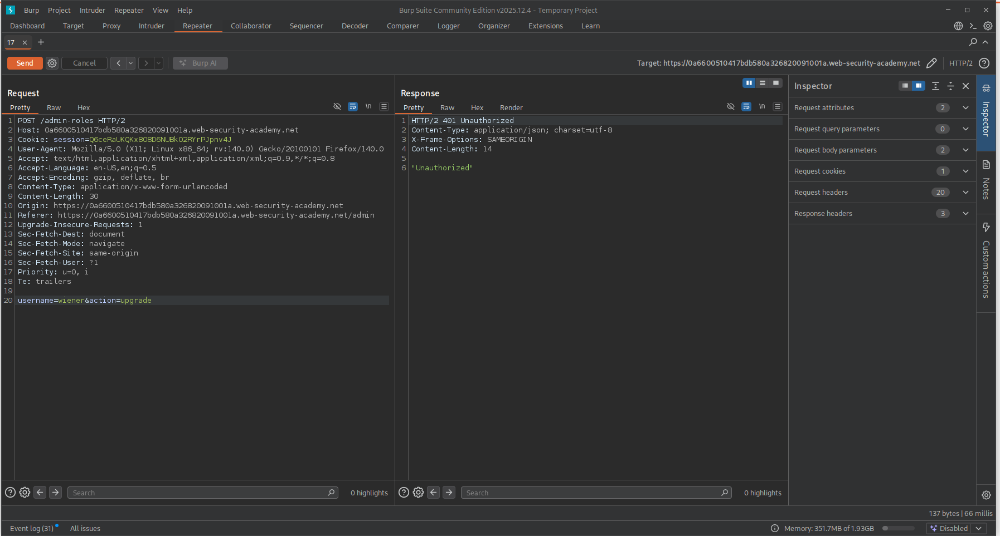
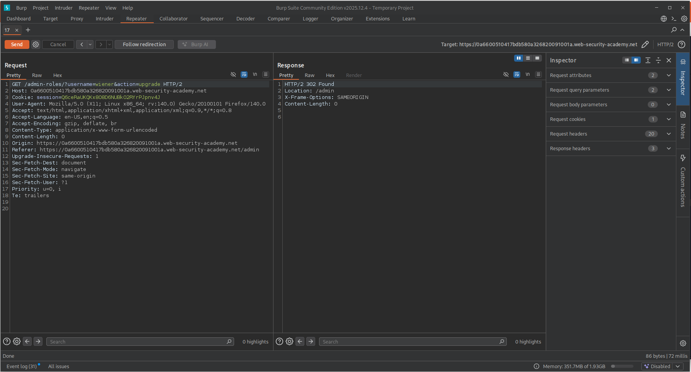

# Access Control Vulnerability – URL-based access control bypass

## Lab: URL-based access control can be circumvented


## Lab Info

This lab contains an access control vulnerability in an admin panel.  
Although access to the `/admin` path is blocked at the front-end level, the backend application trusts the `X-Original-URL` HTTP header, which allows the restriction to be bypassed.


## Goal

Access the admin panel and delete the user **carlos**.


## Logic Overview

- The application has an **unauthenticated admin panel** located at `/admin`.
- Direct access to this path is blocked by a **front-end control**.
- The backend application is deployed behind a **reverse proxy** and supports the `X-Original-URL` header.
- The backend incorrectly trusts this header to determine the requested resource.

If the `X-Original-URL` header is controlled by the client, it can be abused to bypass access control checks.


## Step 1 – Understanding the `X-Original-URL` Header

`X-Original-URL` is an HTTP header commonly used by reverse proxies and web servers to forward the original requested URL to the backend application after URL rewriting or routing.

It allows the backend to understand which resource the client initially requested.  
If a backend application incorrectly trusts this header and allows clients to control it, it may lead to authorization or access control bypass vulnerabilities.


## Step 2 – Inspecting the Admin Panel Access

When attempting to access the admin panel directly:




The application responds with an **Access Denied** message, indicating that access is blocked at the front-end level.


## Step 3 – Bypassing the Restriction Using `X-Original-URL`

The request is sent to **Burp Suite Repeater**, where it is modified as follows:




After resending the request, the server responds with **HTTP 200**, and the admin panel becomes accessible.

This confirms that the backend trusts the `X-Original-URL` header to determine access permissions.

---

## Step 4 – Identifying the Delete Endpoint

Inside the admin panel, a delete functionality is found for user management.

Searching for the username **carlos**, the following delete endpoint is identified:


## Step 5 – Deleting the User "carlos"

The delete request is crafted using the same bypass technique:




After sending the request, the user **carlos** is successfully deleted, completing the lab.


## Result

- Access control was bypassed using the `X-Original-URL` header.
- Unauthorized access to the admin panel was achieved.
- The target user **carlos** was successfully deleted.


## Security Impact

This vulnerability allows attackers to bypass front-end access controls and directly access restricted backend functionality.


## Mitigation

- Do not trust client-controlled headers such as `X-Original-URL` for authorization decisions.
- Enforce access control checks at the backend application level.
- Strip or validate proxy-related headers before processing requests.


## Lab 2: Method-based access control can be circumvented

## Logic:

This lab implements access controls that rely partly on the HTTP method used in requests.

The application includes an admin panel that can be accessed by logging in with the credentials:

```
Username: administrator
Password: admin
```

## Goal:

The goal is to log in as a normal user and exploit the flawed access controls to escalate privileges and become an administrator.

Log in as the user **wiener** and promote to administrator.

## Step 1 - Understanding the admin’s requests

First, we log in as administrator to observe how the application performs privileged actions.

As an example, we upgrade another user (Carlos) to inspect:

- the request URL

- the HTTP method

- request parameters

- the server response


From the captured request, we observe:

- The action is performed via a POST request

- The request includes parameters such as:
    ```
    username

    action=upgrade
    ```

This confirms that user role changes are handled by a backend endpoint that relies on the HTTP method.

## Step 2 – Replaying the request as a normal user

Next, we log in as the user **wiener**.

We reuse our own session cookie and attempt to send the same POST request used by the administrator.



The server responds with an “Unauthorized” message, indicating that direct reuse of the admin request is blocked.

## Step 3 – Testing alternative HTTP methods

Since the lab description mentions method-based access control, we test whether the backend enforces authorization consistently across different HTTP methods.

We resend the same request but change the HTTP method.



This time, the server responds with a redirect back to /admin, identical to the response received when the real administrator upgrades a user.

This confirms that:

- Authorization checks are enforced for one HTTP method, but missing or broken for another.

As a result, our account is successfully promoted to administrator, and the lab is solved.

## Security Impact

This vulnerability demonstrates why authorization must never depend on HTTP methods alone.

Backends must:

-Enforce role checks on every request regardless of HTTP method, and never trust client-controlled behavior.


